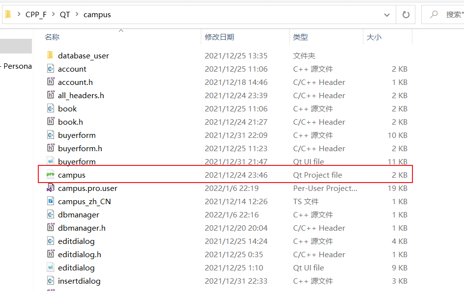
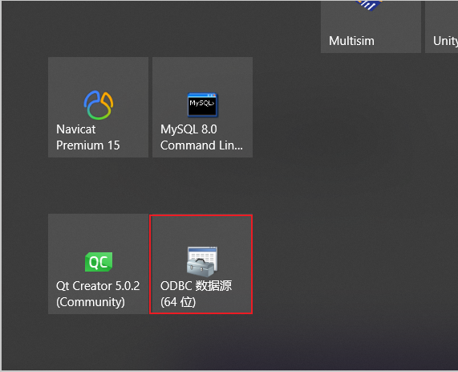
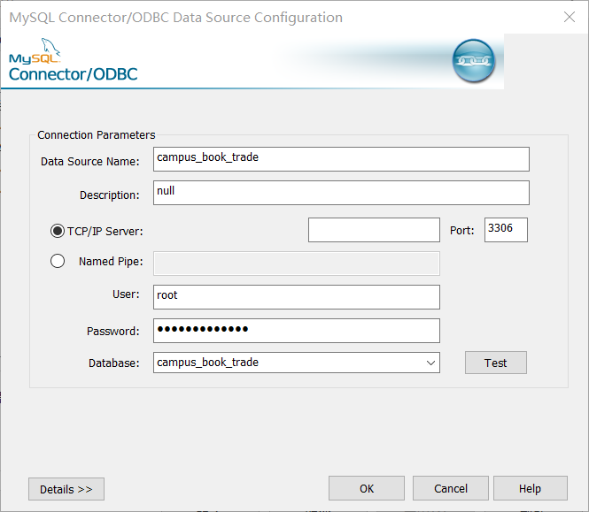
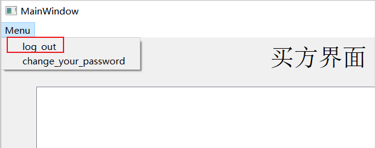
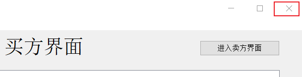

# 0.工程文件路径

/campus/campus.pro

# 1.数据库登录信息

数据库账号的信息文本文件存在工程中的"database_user"目录中

# 2.ODBC数据库

本次没有直接使用mysql连接。而是通过ODBC间接连接mysql数据库

# 3.退出的两种情况

①在用户界面选择log_out会退回登录界面。

②在用户界面直接点击右上角的X会结束程序

