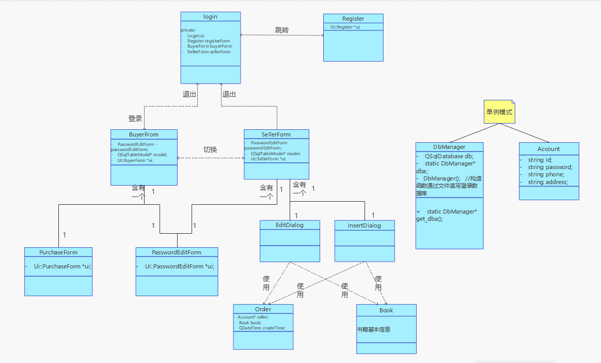

<br><br><br><br><br><br><br><br>

# <center><b>C++程序设计课程设计</b> </center>


<center><font size=4>（2021/2022学年第一学期）<br><br><br></center>

<center><br><br><br><br><br>
    <b>
        <font size="4">指导教师：庄巧莉、霍旭文
    </b>
        <br><br><br><br><br>
</center>
<br><br><br><br>

<center><b><font size="4">班级：20计算机科学与技术(4)</b><br></center>

<center><b><font size="4">学号：2020333503081</b><br></center>

<center><b><font size="4">姓名：陈伟剑</b><br></center>

<div STYLE="page-break-after:always;"></div>


# 【工作内容及工作计划】

<table>
<tr>
  <th colspan="2">时间</th>
  <th size="1.5">地点</th>
  <th>工作内容</th>
  <th>指导教师</th>
</tr>
<tr>
  <td>2021.12.8</td>
  <td>下午</td> 
  <td>软件实验室10-308</td>
  <td>教师讲解课题，以及C++连接数据库相关技术内容</td>
  <td>庄巧莉、霍旭文</td>
</tr>
<tr>
  <td>2021.12.11~15</td>
  <td>		</td> 
  <td>软件实验室10-308、10-409</td>
  <td>需求分析、类设计、数据库设计、部分代码编写</td>
  <td></td>
</tr>
<tr>
  <td>2021.12.22</td>
  <td>下午</td> 
  <td>软件实验室</td>
  <td>中期检查</td>
  <td>庄巧莉、霍旭文</td>
</tr>
    <tr>
  <td>2021.12.25~2022.1.2</td>
  <td>		</td> 
  <td>软件实验室10-308、10-409</td>
  <td>代码编写、完善课设报告</td>
  <td>		</td>
</tr>
<tr>
  <td>2022.1.7</td>
  <td>上午</td> 
  <td>软件实验室10-409</td>
  <td>课设答辩</td>
  <td>庄巧莉、霍旭文</td>
</tr>
    </table>


<table>
<div STYLE="page-break-after:always;"></div>

# 目录

[toc]


# 一、任务要求

## 背景

​        为了使同学们手中闲置的书籍能再次发挥其价值，现在需要你针对在校学生开发一款小型的二手书交易系统。每个同学既可以是卖方，也可以是买方。该系统能帮助卖方同学发布需要售卖的二手书信息，帮助买方同学购买到所需书籍，实现校园内部的便捷交易。

## 前提假设

1. 一个账号既能当买方，也能当卖方，不用考虑一个账号的角色属性。用户根据账号、密码登录系统。
2. 买方一次可以购买一本书。
3. 对于一个账号，一种书默认为1本。即不考虑一个账号管理许多本同一种书的情况。因为该平台的首要目的不是实现书店出售大量书籍的功能，而是实现少部分书籍从一个用户转交给另一个用户的功能。 

## 基本任务

1. 卖方可将需要售卖的书籍信息录入系统，书籍信息包括 ISBN 编号、书籍名称、作者、出版社、价格、新旧程度、取书方式等。买方可查看正在售卖的所有书籍信息，并能够选择购买某一书籍，完成交易。
2. 买方、卖方信息均保存在数据库中，其中，连接数据库所需信息（数据库服务器地址、用户名、密码、数据库名）存放在文件中，程序通过从文件中读取这些信息获得与数据库的连接。实现用户的注册功能，注册信息包括用户名、密码、联系地址、联系电话。
3. 书籍信息和订单信息保存在数据库中，卖方能够对自己的书库进行增删改查。
4. 系统可以查询并统计订单。对于买方，可以查询自己的购买订单并统计数量；对于卖方，可以查询自己的售出订单并统计数量。购买订单和售出订单是订单在买卖方两个不同角度的不同说法。


<div STYLE="page-break-after:always;"></div>

# 二、业务流程图

## 2.1 登录流程


<div STYLE="page-break-after:always;"></div>

## 2.2 注册流程


<div STYLE="page-break-after:always;"></div>

## 2.3 买方界面

### 2.3.1 查看正在售卖的书籍


### 2.3.2 按关键字查看正在售卖的书籍


### 2.3.3 买书流程


<div STYLE="page-break-after:always;"></div>

### 2.3.4 查看购买订单


<div STYLE="page-break-after:always;"></div>

### 2.3.5 修改密码

注：卖方的修改密码流程同理，故卖方部分会省略修改密码相关内容


<div STYLE="page-break-after:always;"></div>

## 2.4 卖方界面

### 2.4.1 查看自己的书库


### 2.4.2 增加一本书


### 2.4.3 删除一本书


### 2.4.4 修改一本书


<div STYLE="page-break-after:always;"></div>

### 2.4.5 查看售出订单


# 三、系统功能结构图

## 3.1 总体功能布局


<div STYLE="page-break-after:always;"></div>

## 3.2 界面联系布局


# 四、类的设计



涉及的类：用户类(Account)、书籍类(Book)、订单类(Order)、数据库连接类(DbManager)、登陆界面类(Login)、注册界面类(Register)、买方界面类(BuyerForm)、卖方界面类(SellerForm)、修改密码界面类(PasswordEditForm)、购买订单对话框类(PurchaseDialog)、插入书记信息对话框类(InsertDialog)、修改书记信息对话框类(EditDialog)。(共12个)


<div STYLE="page-break-after:always;"></div>

# 五、数据库设计

## 5.1 对象提取和关系说明

涉及三个对象：账号(买方和卖方)对象，书籍对象，订单对象

其中：

1. 一个账号可以是卖方，也可以是买方。
2. 买方一次购买一本书籍。
3. 一次购买生成一个订单。
4. 一个卖(买)方可以拥有多本书，且不考虑书籍重复。
5. 买方买到书后可能会将书的记录删除，如果订单直接以书的内容为外键，则会被级联删除。因此订单的内容可以适当冗余，以防级联删除。


## 5.2 ER图


<div STYLE="page-break-after:always;"></div>

## 5.3 表定义及相关SQL语句

### 5.3.1 表设计

注：横线为主键、加粗字为外键
$$
account(\underline{id},password,phone,address);
$$

$$
book(\underline{id},isbn,writer,publisher,{\pmb{owner}}_{account},takeMethod,price,status,selled);
$$

$$
bookOrder(\underline{id},{\pmb{buyerName}}_{account},{\pmb{sellerName}}_{account},{\pmb{bookName}}_{book},price,createtime);
$$


### 5.3.2 SQL建表

```sql
/*创建account表*/
CREATE TABLE `account` (
  `id` varchar(40) NOT NULL,
  `password` varchar(20) NOT NULL,
  `phone` varchar(20) NOT NULL,
  `address` varchar(255) NOT NULL,
  PRIMARY KEY (`id`)
) ENGINE=InnoDB DEFAULT CHARSET=utf8mb3;


/*创建book表*/
CREATE TABLE `book` (
  `id` int unsigned NOT NULL AUTO_INCREMENT,
  `isbn` varchar(80) NOT NULL,
  `bookName` varchar(255) NOT NULL,
  `writer` varchar(40) NOT NULL,
  `publisher` varchar(40) NOT NULL,
  `owner` varchar(40) NOT NULL,
  `takeMethod` varchar(255) NOT NULL,
  `price` float(9,2) NOT NULL,
  `status` tinyint NOT NULL,
  `selled` tinyint NOT NULL,
  PRIMARY KEY (`id`),
  KEY `owner` (`owner`),
  CONSTRAINT `owner` FOREIGN KEY (`owner`) REFERENCES `account` (`id`) ON DELETE CASCADE ON UPDATE RESTRICT
) ENGINE=InnoDB AUTO_INCREMENT=13463 DEFAULT CHARSET=utf8mb3;


/*创建bookOrder表*/
CREATE TABLE `bookorder` (
  `id` int unsigned NOT NULL AUTO_INCREMENT,
  `buyerName` varchar(40) NOT NULL,
  `sellerName` varchar(40) NOT NULL,
  `bookName` varchar(255) NOT NULL,
  `Price` float(9,2) NOT NULL,
  `createTime` datetime NOT NULL,
  PRIMARY KEY (`id`),
  KEY `buyerName` (`buyerName`),
  KEY `sellerName` (`sellerName`),
  CONSTRAINT `buyerName` FOREIGN KEY (`buyerName`) REFERENCES `account` (`id`) ON DELETE CASCADE,
  CONSTRAINT `sellerName` FOREIGN KEY (`sellerName`) REFERENCES `account` (`id`) ON DELETE CASCADE
) ENGINE=InnoDB AUTO_INCREMENT=19 DEFAULT CHARSET=utf8mb3;
```


## 5.4 视图定义及相关SQL语句

详细订单视图(连接account表和bookOrder表，在bookOrder表的基础上加入买(卖)方的联系电话和联系地址)
$$
detailOrder(id,\\buyerName,buyerPhone,buyerAddress,\\sellerName,sellerPhone,sellerAddress,\\bookName,price,purchaseTime);
$$


```SQL
CREATE VIEW `detailorder` AS 
select `bookorder`.`id` AS `id`,
		`buyer`.`id` AS `buyerName`,`buyer`.`phone` AS `buyerPhone`,`buyer`.`address` AS `buyerAddress`,
		`seller`.`id` AS `sellerName`,`seller`.`phone` AS `sellerPhone`,`seller`.`address` AS `sellerAddress`,
		`bookorder`.`bookName` AS `bookName`,`bookorder`.`Price` AS `price`,
		`bookorder`.`createTime` AS `purchaseTime` 
from (
    (`bookorder` 
     	join `account` `buyer` on((`buyer`.`id` = `bookorder`.`buyerName`))) 
    	join `account` `seller` on((`seller`.`id` = `bookorder`.`sellerName`))
)
```


<div STYLE="page-break-after:always;"></div>

# 六、程序代码与说明

## 6.0 all_headers.h

```cpp
#pragma once
#ifndef ALL_HEADERS_H
#define ALL_HEADERS_H


//CPP
#include<iostream>
#include<fstream>
#include<algorithm>
#include<cstring>
#include<ctype.h>
#include<malloc.h> /* malloc()等 */
#include<limits.h> /* INT_MAX等 */
#include<cstdio> /* EOF(=^Z或F6),NULL */
#include<cstdlib> /* atoi() */
#include<cstdio>
#include<string>
#include<queue>
#include<stack>
#include<vector>
#include<map>
#include<set>
#include<list>
#include<io.h> /* eof() */
#include<process.h> /* exit() */


//QT-->BASIC
#include <QMainWindow>
#include <QWidget>
#include <QMessageBox>
#include <QApplication>
#include <QCoreApplication>
#include <QLocale>
#include <QTranslator>
#include <QObject>
#include <QFile>   //QT文件读写
#include <QFileDevice>
#include <QString>
#include <QStringList>
#include <QDateTime>
#include <QRegularExpression>
#include <QDateTime>
#include <QRegExp>  //正则表达式

//QT-->SQL
#include <QApplication>
#include <QLocale>
#include <QTranslator>
#include <QStandardItemModel>
#include <QSqlQuery>
#include <QSqlQueryModel>
#include <QSqlDatabase>
#include <QSqlError>
#include <QDebug>  //QT控制台输出
#include <QSqlTableModel>
#include <QSqlRecord>

#define OK 1
#define ERROR 0
#define TRUE 1
#define FALSE 0
#define MAXSIZE 2
#define INF 1e8

using namespace std;


#endif // ALL_HEADERS_H
```


## 6.1 Account(用户类)

### 6.1.1 account.h

```cpp
#ifndef ACCOUNT_H
#define ACCOUNT_H
#include "all_headers.h"

class Account
{
public:
    static Account* get_account(){
        if(account==NULL) account=new Account("0","0","0","0");
        return account;
    }

    Account();
    Account(QString id,QString password,QString phone, QString address);

    //设置内容
    void renew_account(QString id,QString password,QString phone, QString address);
    void renew_account(Account& user);
    void set_id(QString id);
    void set_password(QString password);
    void set_phone(QString phone);
    void set_address(QString address);


    //获取内容
    QString get_id();
    QString get_password();
    QString get_phone();
    QString get_address();


private:
    QString id;
    QString password;
    QString phone;
    QString address;
    static Account* account;
};

#endif // ACCOUNT_H

```


### 6.1.2 account.cpp

```cpp
#include "account.h"

Account::Account(){ }

Account::Account(QString id, QString password, QString phone, QString address)
    :id(id),password(password),phone(phone),address(address){
}


//============================设置内容==============================


void Account::renew_account(QString id, QString password, QString phone, QString address)
{
    set_id(id);
    set_password(password);
    set_phone(phone);
    set_address(address);
}

void Account::renew_account(Account &user)
{
    set_id(user.get_id());
    set_password(user.get_password());
    set_phone(user.get_phone());
    set_address(user.get_password());
}

void Account::set_id(QString id){this->id=id;}
void Account::set_password(QString password){this->password=password;}
void Account::set_phone(QString phone){this->phone=phone;}
void Account::set_address(QString address){this->address=address;}

//============================获取内容==============================
QString Account::get_id(){return this->id;}
QString Account::get_password(){return this->password;}
QString Account::get_phone(){return this->phone;}
QString Account::get_address(){return this->address;}

```


## 6.2 Book(书籍类)

### 6.2.1 book.h

```cpp
#ifndef BOOK_H
#define BOOK_H

#include "all_headers.h"

class Book
{
public:
    Book();

    Book(int id, QString ISBN, QString bookName, QString writer, QString publisher,QString owner, float price,  QString takeMethod, int status, int selled );

    //设置内容
    void renew_book(QString ISBN, QString bookName, QString writer, QString publisher,QString owner, float price,  QString takeMethod, int status, int selled);
    void set_isbn(QString isbn);
    void set_bookName(QString bookName);
    void set_writer(QString writer);
    void set_publisher(QString publisher);
    void set_takeMethod(QString takeMethod);
    void set_owner(QString owner);
    void set_price(float price);
    void set_status(int status);
    void set_selled(int selled);


    //获取内容
    int get_id();
    QString get_isbn();
    QString get_bookName();
    QString get_writer();
    QString get_publisher();
    QString get_takeMethod();
    QString get_owner();
    float get_price();
    int get_status();
    int get_selled();


private:
    int id;
    QString isbn;
    QString bookName;
    QString writer;
    QString publisher;
    QString owner;
    float price;
    QString takeMethod;
    int status;
    int selled;
};

#endif // BOOK_H
```


### 6.2.2 book.cpp

```cpp
#include "book.h"

Book::Book(){}

Book::Book(int id, QString ISBN, QString bookName, QString writer, QString publisher,QString owner, float price,  QString takeMethod, int status, int selled)
    :id(id),isbn(ISBN),bookName(bookName),writer(writer),publisher(publisher),owner(owner),price(price),takeMethod(takeMethod),status(status),selled(selled){
}


//============================设置内容==============================
void Book::renew_book(QString ISBN, QString bookName, QString writer, QString publisher,QString owner, float price,  QString takeMethod, int status, int selled){
    set_isbn(ISBN);
    set_bookName(bookName);
    set_writer(writer);
    set_publisher(publisher);
    set_takeMethod(takeMethod);
    set_owner(owner);
    set_price(price);
    set_status(status);
    set_selled(selled);
}
void Book::set_isbn(QString isbn){this->isbn=isbn;}
void Book::set_bookName(QString bookName){this->bookName=bookName;}
void Book::set_writer(QString writer){this->writer=writer;}
void Book::set_publisher(QString publisher){this->publisher=publisher;}
void Book::set_takeMethod(QString takeMethod){this->takeMethod=takeMethod;}
void Book::set_owner(QString owner){this->owner=owner;}
void Book::set_price(float price){this->price=price;}
void Book::set_status(int status){this->status=status;}
void Book::set_selled(int selled){this->selled=selled;}


//============================获取内容==============================
int Book::get_id(){return this->id;}
QString Book::get_isbn(){return this->isbn;}
QString Book::get_bookName(){return this->bookName;}
QString Book::get_writer(){return this->writer;}
QString Book::get_publisher(){return this->publisher;}
QString Book::get_takeMethod(){return this->takeMethod;}
QString Book::get_owner(){return this->owner;}
float Book::get_price(){return this->price;}
int Book::get_status(){return this->status;}
int Book::get_selled(){return this->selled;}
```


## 6.3 Order(订单类)

### 6.3.1 order.h

```cpp
#pragma once
#ifndef ORDER_H
#define ORDER_H

#include "all_headers.h"
#include "book.h"
#include "account.h"
#include "dbmanager.h"

class Order
{
public:
    Order();
    //交易完成后，订单便不可再修改
    Order(QString sellerName,Book book);

    Account* get_seller();
    Book* get_book();
    QDateTime get_time();

private:
    Account* seller;
    Book book;
    QDateTime createTime;
};

#endif // ORDER_H

```


### 6.3.2 order.cpp

```cpp
#pragma once
#include "order.h"

Order::Order(){}

Order::Order(QString sellerName,Book book)
    :book(book){
    //设置卖方信息
    QString search=QString("select * from account"
                           " where id='%1'").arg(sellerName);
    DbManager* dba=DbManager::get_dba();
    QSqlQuery res(dba->db);
    res.exec(search);
    res.next();
    this->seller=new Account(res.value("id").toString(),res.value("password").toString(),
                             res.value("phone").toString(),res.value("address").toString());
}

Account *Order::get_seller(){return this->seller;}
Book *Order::get_book(){return &(this->book);}
QDateTime Order::get_time(){return this->createTime.currentDateTime();}


```


## 6.4 DbManager(数据库连接类)

### 6.4.1 dbmanager.h

```cpp
#pragma once
#ifndef DBMANAGER_H
#define DBMANAGER_H
#include "all_headers.h"

class DbManager
{
private:
    static DbManager* dba;

    DbManager();
    ~DbManager();
public:
    static DbManager* get_dba(){
        if(dba==NULL) dba=new DbManager();
        return dba;
    }
    QSqlDatabase db;
};

#endif // DBMANAGER_H

```


### 6.4.2 dbmanager.cpp

```cpp
#pragma once
#include "dbmanager.h"


/*
函数名:DbManager
功能:构造函数。通过读取txt文件中的账号信息连接数据库
*/
DbManager::DbManager()
{
    db=QSqlDatabase::addDatabase("QODBC");

    QFile ifs("./database_user/accounts.txt");
    if(!ifs.open(QIODevice::ReadOnly | QIODevice::Text)){
        qDebug()<<"数据库账号文件打开失败";
    }

    ifs.readLine();//跳过第一行
    QString a=ifs.readLine();
    QStringList list=a.split(' ');   //空格作为分隔符拆开一行文本

    db.setHostName(list[0]);
    db.setDatabaseName(list[1]);
    db.setUserName(list[2]);
    db.setPassword(list[3]);
    db.setPort(list[4].toInt());

    if(!db.open()){
        QMessageBox::information(NULL,"DBA","数据库连接失败");
    }
    else {
        QMessageBox::information(NULL,"DBA","数据库连接成功");
    }

    ifs.close();
}
DbManager::~DbManager(){}
```


## 6.5 Login(登录界面类)

### 6.5.1 login.h

```cpp
#pragma once
#ifndef LOGIN_H
#define LOGIN_H

#include "all_headers.h"
#include "register.h"
#include "buyerform.h"
#include "sellerform.h"
#include "dbmanager.h"
#include "account.h"

QT_BEGIN_NAMESPACE
namespace Ui { class Login; }
QT_END_NAMESPACE

class Login : public QMainWindow
{
    Q_OBJECT

public:
    Login(QWidget *parent = nullptr);
    ~Login();


private slots:
    //自定义控件事件
    void register_button_click();   //按下注册按钮
    void login_button_click();   //按下登录按钮

    //接收其他窗口发出的信号
    void receive_from_register();
    void receive_from_buyerOrseller();

signals://信号量只用声明不用实现
    void show_registerForm();
    void show_buyerForm();

private:
    Ui::Login *ui;
};
#endif // LOGIN_H
```


### 6.5.2 login.cpp

```cpp
#pragma once
#include "login.h"
#include "ui_login.h"
#include "buyerform.h"


Login::Login(QWidget *parent)
    : QMainWindow(parent)
    , ui(new Ui::Login)
{
    ui->setupUi(this);

    //限制输入长度
    this->ui->accountTextbox->setMaxLength(40);
    this->ui->passwordTextbox->setMaxLength(20);
        
    this->ui->accountTextbox->setText("Mitchell");
    this->ui->passwordTextbox->setText("123456");

}

Login::~Login()
{
    delete ui;
}


//=========================================private slots================================================
//-----------------------------------------自定义控件事件--------------------------------------------------------


/*
函数名：register_button_click()
功能：进入注册界面
*/
void Login::register_button_click()
{
    this->hide();
    emit show_registerForm();
}


/*
函数名：login_button_click()
功能：登录流程
*/
void Login::login_button_click()
{
    //存储输入的账号信息
    QString id=this->ui->accountTextbox->text();
    QString passwd=this->ui->passwordTextbox->text();
    if(id.isEmpty() || passwd.isEmpty()){
        QMessageBox::warning(NULL,"error","用户名或密码未输入");
        return ;
    }

    //匹配数据库中的账号
    QString search=QString("select * from account"
                           " where id='%1' and password ='%2'").arg(id).arg(passwd);
    DbManager* dba=DbManager::get_dba();
    QSqlQuery res(dba->db);
    res.exec(search);
    if(!res.next()){
        QMessageBox::warning(NULL,"error","账号或密码错误");
        return ;
    }

    //登录成功后，获取该用户的基本信息并初始化account对象
    QString userId=res.value("id").toString();
    QString userPassword=res.value("password").toString();
    QString userPhone=res.value("phone").toString();
    QString userAddress=res.value("address").toString();
    Account* user=Account::get_account();
    user->renew_account(userId,userPassword,userPhone,userAddress);
    qDebug()<<userId<<userPassword<<userPhone<<userAddress;


    this->hide();
    emit show_buyerForm();

}


//------------------------------------------接收其他窗口发出的信号----------------------------------------

/*
函数名：receive_from_register()
功能：注册操作完成后返回登录界面
*/
void Login::receive_from_register()
{
    this->ui->accountTextbox->clear();
    this->ui->passwordTextbox->clear();
    this->show();
}


/*
函数名：receive_from_buyer()
功能：从买方或卖方界面退出
*/
void Login::receive_from_buyerOrseller()
{
    this->ui->accountTextbox->clear();
    this->ui->passwordTextbox->clear();
    this->show();
}

```


### 6.5.3 login.ui


## 6.6 Register(注册界面类)

### 6.6.1 register.h

```cpp
#pragma once
#ifndef REGISTER_H
#define REGISTER_H

#include "all_headers.h"
#include "account.h"
#include "dbmanager.h"

namespace Ui {
class Register;
}

class Register : public QWidget
{
    Q_OBJECT

public:
    explicit Register(QWidget *parent = nullptr);
    ~Register();

private slots:
    //自定义控件事件
    void register_button_click();
    void cancel_button_click();

    //接收其他窗口发出的信号
    void receive_from_login();


signals:
    void show_loginForm();

private:
    Ui::Register *ui;
};

#endif // REGISTER_H

```


### 6.6.2 register.cpp

```cpp
#pragma once
#include "register.h"
#include "ui_register.h"

Register::Register(QWidget *parent) :
    QWidget(parent),
    ui(new Ui::Register)
{
    ui->setupUi(this);
        
    //限制输入长度
    this->ui->userNameTextbox->setMaxLength(35);
    this->ui->passwordTextbox->setMaxLength(20);
    this->ui->phoneTextbox->setMaxLength(20);
    this->ui->addressTextbox->setMaxLength(250);
}

Register::~Register()
{
    delete ui;
}


//=============================================private slots==========================================
//----------------------------------------------自定义控件事件-----------------------------------------


/*
函数名：register_botton_click()
功能：注册一个账号并存入account数据表
*/

void Register::register_button_click()
{
    //获取输入框信息
    QString id=this->ui->userNameTextbox->text();
    QString password=this->ui->passwordTextbox->text();
    QString phone=this->ui->phoneTextbox->text();
    QString address=this->ui->addressTextbox->text();

    //输入检查
    if(id.isEmpty() || password.isEmpty() || phone.isEmpty()|| address.isEmpty()){
        QMessageBox::warning(NULL,"error","注册信息不完整");
        return ;
    }

    Account user(id,password,phone,address);
    //查询account表，判定用户名是否已存在
    DbManager* dba=DbManager::get_dba();
    QSqlQuery res(dba->db);
    QString sqlSentence=QString("select id from account where id='%1';").arg(id);
    res.exec(sqlSentence);
    if(res.next()){ //发现重名就弹窗报错
        QMessageBox::warning(NULL,"error","用户名已存在");
        return ;
    }

    //添加账号记录,弹出成功提示后返回登录界面
    sqlSentence=QString("insert into account values('%1','%2','%3','%4');").arg(id).arg(password).arg(phone).arg(address);
    res.exec(sqlSentence);
    QMessageBox::information(NULL,"success","账号已注册!");
    this->hide();
    emit show_loginForm();
}

/*
函数名：cancel_botton_click()
功能：取消注册，回到登录界面
*/
void Register::cancel_button_click()
{
    this->hide();
    emit show_loginForm();
}


//---------------------------------------------接收其他窗口信号----------------------------------------

/*
函数名：receive_from_login()
功能：接收login界面点击注册按钮后发出的信号，并显示注册界面
*/
void Register::receive_from_login()
{
    this->show();
}

```


### 6.6.3 register.ui


## 6.7 BuyerForm(买方界面类)

### 6.7.1 buyerform.h

```cpp
#pragma once
#ifndef BUYERFORM_H
#define BUYERFORM_H

#include "all_headers.h"
#include "account.h"
#include "sellerform.h"
#include "dbmanager.h"
#include "passwordeditform.h"
#include "purchasedialog.h"

namespace Ui {
class BuyerForm;
}

class BuyerForm : public QMainWindow
{
    Q_OBJECT

public:
    //公用方法
    explicit BuyerForm(QWidget *parent = nullptr);
    ~BuyerForm();

    //Account& get_account();
    PasswordEditForm& get_passwordEditForm();
    void set_booksTableView();
    void set_ordersTableView();

private slots:
    //自定义控件事件
    void on_action_log_out_triggered();
    void goto_sellerForm_click();
    void on_actionchange_your_password_triggered();
    void search_selling_book_click();
    void search_target_book_click();
    void on_purchase_button_click();
    void on_search_buyerOrder_click();


    //接收其他窗口的信号
    void receive_from_login();
    void receive_from_seller();
    void receive_from_purchaseDialog(Order order);


signals:
    void show_loginForm();
    void show_sellerForm();

private:
    Ui::BuyerForm *ui;
    PasswordEditForm passwordEditForm;
    QSqlTableModel* model;
    QSqlTableModel* orderModel;
    PurchaseDialog* purchaseDialog;

};

#endif // BUYERFORM_H
```


### 6.7.2 buyerform.cpp

```cpp
#pragma once
#include "buyerform.h"
#include "ui_buyerform.h"

BuyerForm::BuyerForm(QWidget *parent) :
    QMainWindow(parent),
    ui(new Ui::BuyerForm)
{
    ui->setupUi(this);

    //预设置model
    DbManager* dba=DbManager::get_dba();
    this->model=new QSqlTableModel(this->ui->booksTableView,dba->db);
    this->orderModel=new QSqlTableModel(this->ui->ordersTableView,dba->db);
    //设置为手动提交数据库信息
    model->setEditStrategy(QSqlTableModel::OnManualSubmit);
    orderModel->setEditStrategy(QSqlTableModel::OnManualSubmit);
}

BuyerForm::~BuyerForm()
{
    delete ui;
}

//获取私有对象
PasswordEditForm &BuyerForm::get_passwordEditForm(){return this->passwordEditForm;}


/*
函数名：set_booksTableView()
功能：设置booksTableView的字段行
*/
void BuyerForm::set_booksTableView()
{
    model->setHeaderData(0,Qt::Horizontal,QObject::tr("ID"));
    model->setHeaderData(1,Qt::Horizontal,QObject::tr("ISBN"));
    model->setHeaderData(2,Qt::Horizontal,QObject::tr("书名"));
    model->setHeaderData(3,Qt::Horizontal,QObject::tr("作者"));
    model->setHeaderData(4,Qt::Horizontal,QObject::tr("出版社"));
    model->setHeaderData(5,Qt::Horizontal,QObject::tr("卖方"));
    model->setHeaderData(6,Qt::Horizontal,QObject::tr("获取方式"));
    model->setHeaderData(7,Qt::Horizontal,QObject::tr("价格"));
    model->setHeaderData(8,Qt::Horizontal,QObject::tr("新旧程度"));
    model->setHeaderData(9,Qt::Horizontal,QObject::tr("售出状态"));
}


/*
函数名：set_ordersTableView()
功能：设置ordersTableView的字段行
*/
void BuyerForm::set_ordersTableView()
{
    orderModel->setHeaderData(0,Qt::Horizontal,QObject::tr("ID"));
    orderModel->setHeaderData(1,Qt::Horizontal,QObject::tr("买方"));
    orderModel->setHeaderData(2,Qt::Horizontal,QObject::tr("买方电话"));
    orderModel->setHeaderData(3,Qt::Horizontal,QObject::tr("买方地址"));
    orderModel->setHeaderData(4,Qt::Horizontal,QObject::tr("卖方"));
    orderModel->setHeaderData(5,Qt::Horizontal,QObject::tr("卖方电话"));
    orderModel->setHeaderData(6,Qt::Horizontal,QObject::tr("卖方地址"));
    orderModel->setHeaderData(7,Qt::Horizontal,QObject::tr("书名"));
    orderModel->setHeaderData(8,Qt::Horizontal,QObject::tr("价格"));
    orderModel->setHeaderData(9,Qt::Horizontal,QObject::tr("购买时间"));

}


//===============================================private slots===================================================

//-----------------------------------------------自定义控件事件---------------------------------------------

/*
函数名：on_action_log_out_triggered()
功能：退出当前用户
*/
void BuyerForm::on_action_log_out_triggered()
{
    this->close();
    emit show_loginForm();
}


/*
函数名：goto_sellerForm_click()
功能：当前用户转到卖方界面
*/
void BuyerForm::goto_sellerForm_click()
{
    this->hide();
    emit show_sellerForm();
}

/*
函数名：on_actionchange_your_password_triggered()
功能：弹出修改密码界面
*/
void BuyerForm::on_actionchange_your_password_triggered()
{
    this->passwordEditForm.clear_lineEdit();
    this->passwordEditForm.show();
}


/*
函数名：search_selling_book_click()
功能：查询所有在售书籍
*/
void BuyerForm::search_selling_book_click()
{
    model->setTable("book");
    Account* account=Account::get_account();

    //筛选条件
    model->setFilter(QString("owner!='%1' and selled=0").arg(account->get_id()));
    model->select();

    //设置表头
    this->set_booksTableView();

    this->ui->booksTableView->setModel(model);
    //table界面设为不可编辑
    this->ui->booksTableView->setEditTriggers(QAbstractItemView::NoEditTriggers);
    if(model->rowCount()==0){
        QMessageBox::information(NULL,"tip","暂无在售书籍");
    }
}


/*
函数名：search_target_book_click()
功能：按关键字搜索指定书籍
*/
void BuyerForm::search_target_book_click()
{

    QString target=this->ui->searchBookTextbox->text();
    Account* account=Account::get_account();

    //筛选条件
    model->setTable("book");
    model->setFilter(QString("owner!='%1' and bookName like '%"+target+"%' ;").arg(account->get_id()));//.arg(target)); //筛选条件
    model->select();

    this->set_booksTableView();

    this->ui->booksTableView->setModel(model);
    //table界面设为不可编辑
    this->ui->booksTableView->setEditTriggers(QAbstractItemView::NoEditTriggers);
    if(model->rowCount()==0){
        QMessageBox::information(NULL,"tip","没有相关在售书籍");
    }
}


/*
函数名：on_purchase_button_click()
功能：打开买书界面
*/
void BuyerForm::on_purchase_button_click()
{
    int curRow=this->ui->booksTableView->currentIndex().row();
    //判断用户是否有选中一条记录，-1代表未选择记录
    if(curRow==-1){
        QMessageBox::warning(NULL,"error","请选择一条书籍记录");
        return ;
    }

    //与购买对话框建立连接
    this->purchaseDialog=new PurchaseDialog(this);
    QObject::connect(purchaseDialog,SIGNAL(purchase_confirm(Order)),this,SLOT(receive_from_purchaseDialog(Order)));

    //获取选中的记录
    QSqlRecord record=this->model->record(curRow);

    //书籍基本信息
    int id=record.value(0).toInt();
    QString isbn=record.value(1).toString();
    QString bookName=record.value(2).toString();
    QString writer=record.value(3).toString();
    QString publisher=record.value(4).toString();
    QString sellerName=record.value(5).toString();
    QString takeMethod=record.value(6).toString();
    float price=record.value(7).toFloat();
    int status=record.value(8).toInt();
    int selled=record.value(9).toInt();
    qDebug()<<price<<status<<selled;
    Account* account=Account::get_account();

    Book book(id,isbn,bookName,writer,publisher,account->get_id(),price,takeMethod,status,selled);

    //设置购买对话框的内容
    this->purchaseDialog->set_ui(sellerName,book);
    this->purchaseDialog->show();
}


/*
函数名：on_search_buyerOrder_click()
功能：查询当前账号作为买方的订单
*/
void BuyerForm::on_search_buyerOrder_click()
{
    orderModel->setTable("detailorder");
    Account* account=Account::get_account();
    //筛选条件
    orderModel->setFilter(QString("buyerName='%1'").arg(account->get_id()));
    orderModel->select();

    //设置订单栏的表头
    this->set_ordersTableView();

    this->ui->ordersTableView->setModel(orderModel);
    this->ui->ordersTableView->setEditTriggers(QAbstractItemView::NoEditTriggers);
    this->ui->orderNumsLabel->setText(QString("订单总数：%1").arg(orderModel->rowCount()));
    if(orderModel->rowCount()==0){
        QMessageBox::information(NULL,"tip","该用户暂无购入订单");
    }
}


//------------------------------------------接收其他窗口的信号--------------------------------------------

/*
函数名：receive_from_login()
功能：完成登录事件后进入买方界面，并清空买方界面中tableview的内容
*/
void BuyerForm::receive_from_login()
{
    //清空两个tableview的内容
    QSqlQueryModel* res=new QSqlQueryModel(this->ui->booksTableView);
    res->clear();
    this->ui->booksTableView->setModel(res);
    this->ui->ordersTableView->setModel(res);

    Account* account=Account::get_account();
    this->ui->userNameLabel->setText(QString("用户：%1").arg(account->get_id()));
    this->ui->orderNumsLabel->setText(QString("订单总数："));
    this->show();
}

/*
函数名：receive_from_seller()
功能：从卖方界面切换到买方界面，并清空买方界面中tableview的内容
*/
void BuyerForm::receive_from_seller()
{
    //清空两个tableview的内容
    QSqlQueryModel* res=new QSqlQueryModel(this->ui->booksTableView);
    res->clear();
    this->ui->booksTableView->setModel(res);
    this->ui->ordersTableView->setModel(res);
    this->ui->orderNumsLabel->setText(QString("订单总数："));
    this->show();
}


/*
函数名：receive_from_purchaseDialog()
功能：完成购买流程
*/
void BuyerForm::receive_from_purchaseDialog(Order order)
{
    orderModel->setTable("bookorder");
    orderModel->select();

    //设置订单记录
    QSqlRecord record=orderModel->record();
    Account* account=Account::get_account();
    record.setValue(1,account->get_id());
    record.setValue(2,order.get_seller()->get_id());
    record.setValue(3,order.get_book()->get_bookName());
    record.setValue(4,QString("%1").arg(order.get_book()->get_price()));
    record.setValue(5,order.get_time());

    if(orderModel->insertRecord(orderModel->rowCount(),record)){
        QMessageBox::information(NULL,"success","购买成功!");

        //修改书籍拥有者，并将书籍售出状态设置为1(已售出)
        int curRow=this->ui->booksTableView->currentIndex().row();
        QSqlRecord purchasedBook=model->record(curRow);
        purchasedBook.setValue(5,account->get_id());
        purchasedBook.setValue(9,1);
        model->setRecord(curRow,purchasedBook);

        //提交所有修改信息
        model->submitAll();
        orderModel->submitAll();
        this->purchaseDialog->close();
        this->on_search_buyerOrder_click();
    }
    else{
        QMessageBox::warning(NULL,"error","购买失败。");
        this->purchaseDialog->close();
    }
}

```


### 6.7.3 buyerform.ui


## 6.8 SellerForm(卖方界面类)

### 6.8.1 sellerform.h

```cpp
#pragma once
#ifndef SELLERFORM_H
#define SELLERFORM_H

#include "all_headers.h"
#include "account.h"
#include "dbmanager.h"
#include "passwordeditform.h"
#include "insertdialog.h"
#include "editdialog.h"
#include "book.h"

namespace Ui {
class SellerForm;
}

class SellerForm : public QMainWindow
{
    Q_OBJECT

public:
    explicit SellerForm(QWidget *parent = nullptr);
    ~SellerForm();

    PasswordEditForm &get_passwordEditForm();
    void set_booksTableView();
    void set_ordersTableView();

private slots:
    //自定义控件事件
    void on_action_log_out_triggered();
    void goto_buyerForm_click();
    void on_actionchange_your_password_triggered();
    void get_my_book_click();
    void search_target_book_click();
    void on_edit_button_clicked();
    void on_insert_button_clicked();
    void on_delete_button_clicked();
    void on_search_sellerOrder_click();

    //接收其他窗口的信号
    void receive_from_buyer();
    void receive_from_edit_confirm(Book book);
    void receive_from_insert_confirm(Book book);

signals:
    void show_buyerForm();
    void show_loginForm();

private:
    Ui::SellerForm *ui;
    PasswordEditForm passwordEditForm;
    QSqlTableModel* model;
    QSqlTableModel* orderModel;
    EditDialog* editDialog;
    InsertDialog* insertDialog;
};

#endif // SELLERFORM_H
```


### 6.8.2 sellerform.cpp

```cpp
#pragma once
#include "sellerform.h"
#include "ui_sellerform.h"

SellerForm::SellerForm(QWidget *parent) :
    QMainWindow(parent),
    ui(new Ui::SellerForm)
{
    ui->setupUi(this);

    //预设置model
    DbManager* dba=DbManager::get_dba();
    model=new QSqlTableModel(this->ui->booksTableView,dba->db);
    this->orderModel=new QSqlTableModel(this->ui->ordersTableView,dba->db);
    model->setEditStrategy(QSqlTableModel::OnManualSubmit);
    orderModel->setEditStrategy(QSqlTableModel::OnManualSubmit);
}

SellerForm::~SellerForm()
{
    delete ui;
}

//获取私有对象
PasswordEditForm &SellerForm::get_passwordEditForm(){return this->passwordEditForm;}


/*
函数名：set_booksTableView()
功能：设置booksTableView的字段行
*/
void SellerForm::set_booksTableView()
{
    model->setHeaderData(0,Qt::Horizontal,QObject::tr("ID"));
    model->setHeaderData(1,Qt::Horizontal,QObject::tr("ISBN"));
    model->setHeaderData(2,Qt::Horizontal,QObject::tr("书名"));
    model->setHeaderData(3,Qt::Horizontal,QObject::tr("作者"));
    model->setHeaderData(4,Qt::Horizontal,QObject::tr("出版社"));
    model->setHeaderData(5,Qt::Horizontal,QObject::tr("卖方"));
    model->setHeaderData(6,Qt::Horizontal,QObject::tr("获取方式"));
    model->setHeaderData(7,Qt::Horizontal,QObject::tr("价格"));
    model->setHeaderData(8,Qt::Horizontal,QObject::tr("新旧程度"));
    model->setHeaderData(9,Qt::Horizontal,QObject::tr("售出状态"));
}

/*
函数名：set_ordersTableView()
功能：设置ordersTableView的字段行
*/
void SellerForm::set_ordersTableView()
{
    orderModel->setHeaderData(0,Qt::Horizontal,QObject::tr("ID"));
    orderModel->setHeaderData(1,Qt::Horizontal,QObject::tr("买方"));
    orderModel->setHeaderData(2,Qt::Horizontal,QObject::tr("买方电话"));
    orderModel->setHeaderData(3,Qt::Horizontal,QObject::tr("买方地址"));
    orderModel->setHeaderData(4,Qt::Horizontal,QObject::tr("卖方"));
    orderModel->setHeaderData(5,Qt::Horizontal,QObject::tr("卖方电话"));
    orderModel->setHeaderData(6,Qt::Horizontal,QObject::tr("卖方地址"));
    orderModel->setHeaderData(7,Qt::Horizontal,QObject::tr("书名"));
    orderModel->setHeaderData(8,Qt::Horizontal,QObject::tr("价格"));
    orderModel->setHeaderData(9,Qt::Horizontal,QObject::tr("购买时间"));
}


//=========================================private slots================================================
//-----------------------------------------自定义控件事件--------------------------------------------------------

/*
函数名：on_action_log_out_triggered()
功能：退出当前账号
*/
void SellerForm::on_action_log_out_triggered()
{
    this->close();
    emit show_loginForm();
}


/*
函数名：goto_buyerForm_click()
功能：切换到买方界面
*/
void SellerForm::goto_buyerForm_click()
{
    this->close();
    emit show_buyerForm();
}


/*
函数名：on_actionchange_your_password_triggered()
功能：弹出修改密码界面
*/
void SellerForm::on_actionchange_your_password_triggered()
{
    this->passwordEditForm.clear_lineEdit();
    this->passwordEditForm.show();
}


/*
函数名：get_my_book_click()
功能：查询自己的书
*/
void SellerForm::get_my_book_click()
{
    model->setTable("book");
    Account* account=Account::get_account();

    //筛选条件
    model->setFilter(QString("owner='%1'").arg(account->get_id()));
    model->select();

    //设置书籍栏的表头
    this->set_booksTableView();

    this->ui->booksTableView->setModel(model);
    this->ui->booksTableView->setEditTriggers(QAbstractItemView::NoEditTriggers);   //table界面设为不可编辑
    if(model->rowCount()==0){
        QMessageBox::information(NULL,"tip","你的书库为空");
    }
}


/*
函数名：search_target_book_click()
功能：搜索指定书籍
*/
void SellerForm::search_target_book_click()
{

    QString target=this->ui->searchBookTextbox->text();
    Account* account=Account::get_account();
    model->setTable("book");

    //筛选条件
    model->setFilter(QString("owner='%1' and bookName like '%"+target+"%' ;").arg(account->get_id())); //筛选条件
    model->select();

    //设置书籍栏表头
    this->set_booksTableView();
    this->ui->booksTableView->setModel(model);

    if(model->rowCount()==0){
        QMessageBox::information(NULL,"tip","你的书库没有相关书籍");
    }
}


/*
函数名：on_edit_botton_clicked()
功能：修改书籍信息，显示书籍信息编辑界面
*/
void SellerForm::on_edit_button_clicked()
{
    int curRow=this->ui->booksTableView->currentIndex().row();
    if(curRow==-1){
        QMessageBox::warning(NULL,"error","请选择一条书籍记录");
        return ;
    }
    QSqlRecord record=this->model->record(curRow);

    //建立卖书界面和书籍编辑界面的连接
    this->editDialog=new EditDialog(this);
    QObject::connect(editDialog,SIGNAL(book_edit_confirm(Book)),this,SLOT(receive_from_edit_confirm(Book)));


    //书籍基本信息
    int id=record.value(0).toInt();
    QString isbn=record.value(1).toString();
    QString bookName=record.value(2).toString();
    QString writer=record.value(3).toString();
    QString publisher=record.value(4).toString();
    float price=record.value(7).toFloat();
    QString takeMethod=record.value(6).toString();
    int status=record.value(8).toInt();
    int selled=record.value(9).toInt();
    qDebug()<<price<<status<<selled;
    Account* account=Account::get_account();


    Book book(id,isbn,bookName,writer,publisher,account->get_id(),price,takeMethod,status,selled);


    //设置书籍编辑界面的基本信息
    this->editDialog->set_ui(book);
    this->editDialog->show();
}


/*
函数名：on_insert_botton_clicked()
功能：添加一本书，显示书籍信息添加界面
*/
void SellerForm::on_insert_button_clicked()
{
    //建立卖书界面和添加书籍界面的连接
    this->insertDialog=new InsertDialog(this);
    QObject::connect(insertDialog,SIGNAL(book_insert_confirm(Book)),this,SLOT(receive_from_insert_confirm(Book)));
    this->insertDialog->show();
}

/*
函数名：on_delete_botton_clicked()
功能：删除选中的一本书
*/
void SellerForm::on_delete_button_clicked()
{
    int curRow=this->ui->booksTableView->currentIndex().row();
    if(curRow==-1){
        QMessageBox::warning(NULL,"error","请选择一条书籍记录");
        return ;
    }

    this->model->removeRow(curRow);

    //确认删除
    int ok=QMessageBox::warning(this,"删除当前行","确定删除这本书的记录吗？",
                                 QMessageBox::Yes,QMessageBox::No);
    if(ok==QMessageBox::No){
        this->model->revertAll();
        QMessageBox::information(NULL,"revert","已取消");
        return ;
    }
    else{
        this->model->submitAll();
        QMessageBox::information(NULL,"success","相关书本已删除");
    }
}


/*
函数名：on_search_sellerOrder_click()
功能：查询当前账号作为卖方的订单
*/
void SellerForm::on_search_sellerOrder_click()
{
    orderModel->setTable("detailorder");
    Account* account=Account::get_account();

    //筛选条件
    orderModel->setFilter(QString("sellerName='%1'").arg(account->get_id()));
    orderModel->select();

    //设置订单栏表头
    this->set_ordersTableView();

    this->ui->ordersTableView->setModel(orderModel);
    this->ui->ordersTableView->setEditTriggers(QAbstractItemView::NoEditTriggers);
    this->ui->orderNumsLabel->setText(QString("订单总数：%1").arg(orderModel->rowCount()));
    if(orderModel->rowCount()==0){
        QMessageBox::information(NULL,"tip","该用户暂无售出订单");
    }
}


//----------------------------------------------接收其他窗口的信号-----------------------------------------

/*
函数名：receive_from_buyer()
功能：接收从买方界面切换到卖方界面发出的信号，并清空卖方界面中tableview的所有内容
*/
void SellerForm::receive_from_buyer()
{
    //清空两个tableview的内容
    QSqlQueryModel* res=new QSqlQueryModel(this->ui->booksTableView);
    res->clear();
    this->ui->booksTableView->setModel(res);
    this->ui->ordersTableView->setModel(res);

    Account* account=Account::get_account();
    this->ui->userNameLabel->setText(QString("用户：%1").arg(account->get_id()));
    this->ui->orderNumsLabel->setText(QString("订单总数："));
    this->show();
}


/*
函数名：receive_from_edit_confirm(Book book)
功能：接收从修改书籍界面传来的书籍对象信号，并更新数据库
*/
void SellerForm::receive_from_edit_confirm(Book book)
{
    //设置待更新的书籍记录
    int curRow=this->ui->booksTableView->currentIndex().row();
    QSqlRecord record=this->model->record(curRow);
    record.setValue(1,book.get_isbn());
    record.setValue(2,book.get_bookName());
    record.setValue(3,book.get_writer());
    record.setValue(4,book.get_publisher());
    record.setValue(6,book.get_takeMethod());
    record.setValue(7,QString("%1").arg(book.get_price()));
    record.setValue(8,book.get_status());
    record.setValue(9,book.get_selled());


    //提交要更新的记录
    if(model->setRecord(curRow,record)){
        model->submitAll();
        QMessageBox::information(NULL,"success","记录修改成功");
        this->editDialog->close();
    }
    else{
        QMessageBox::warning(NULL,"error","书籍信息修改失败");
    }
}


/*
函数名：receive_from_insert_confirm(Book book)
功能：接收从添加书籍界面传来的书籍对象信号，并插入数据库
*/
void SellerForm::receive_from_insert_confirm(Book book)
{
    //设置要插入的记录
    QSqlRecord record=model->record();

    record.setValue(1,book.get_isbn());
    record.setValue(2,book.get_bookName());
    record.setValue(3,book.get_writer());
    record.setValue(4,book.get_publisher());
    record.setValue(5,book.get_owner());
    record.setValue(6,book.get_takeMethod());
    record.setValue(7,QString("%1").arg(book.get_price()));
    record.setValue(8,book.get_status());
    record.setValue(9,book.get_selled());

    //插入记录
    if(model->insertRecord(model->rowCount(),record)){
        QMessageBox::information(NULL,"success","书本添加成功");
        model->submitAll();
        this->insertDialog->close();
    }
    else{
        QMessageBox::warning(NULL,"error","书本添加失败");
    }

}

```


### 6.8.3 sellerform.ui


## 6.9 PasswordEditForm(修改密码界面类)

### 6.9.1 passwordeditdorm.h

```cpp
#pragma once
#ifndef PASSWORDEDITFORM_H
#define PASSWORDEDITFORM_H

#include "account.h"
#include "dbmanager.h"
#include "order.h"
#include <QWidget>

namespace Ui {
class PasswordEditForm;
}

class PasswordEditForm : public QWidget
{
    Q_OBJECT

public:
    explicit PasswordEditForm(QWidget *parent = nullptr);
    ~PasswordEditForm();
    void clear_lineEdit();

private slots:
    void password_edit_click();
    void cancel_click();

signals:
    void renew_account();

private:
    Ui::PasswordEditForm *ui;
};

#endif // PASSWORDEDITFORM_H

```


### 6.9.2 passwordeditform.cpp

```cpp
#include "passwordeditform.h"
#include "ui_passwordeditform.h"

PasswordEditForm::PasswordEditForm(QWidget *parent) :
    QWidget(parent),
    ui(new Ui::PasswordEditForm)
{
    ui->setupUi(this);
        
    //限制输入长度
    this->ui->originalTextbox->setMaxLength(20);
    this->ui->newTextbox->setMaxLength(20);
    this->ui->newConfirmTextbox->setMaxLength(20);
}

PasswordEditForm::~PasswordEditForm()
{
    delete ui;
}


/*
函数名：clear_lineEdit()
功能：清空界面中的编辑框内容
*/
void PasswordEditForm::clear_lineEdit()
{
    this->ui->originalTextbox->clear();
    this->ui->newTextbox->clear();
    this->ui->newConfirmTextbox->clear();
}


//=============================================private slots==========================================
//----------------------------------------------自定义控件事件-----------------------------------------


/*
函数名：password_edit_click()
功能：确认修改密码
*/
void PasswordEditForm::password_edit_click()
{
    QString original=this->ui->originalTextbox->text();
    QString newPasswd=this->ui->newTextbox->text();
    QString newConfirmPasswd=this->ui->newConfirmTextbox->text();

    Account* account=Account::get_account();

    //信息栏是否完善
    if(original.isEmpty() || newPasswd.isEmpty() || newConfirmPasswd.isEmpty()){
        QMessageBox::warning(NULL,"error","修改信息不完善");
        return ;
    }
    //原密码是否正确
    if(original!=account->get_password()){
        QMessageBox::warning(NULL,"error","原密码不正确");
        return ;
    }
    //新密码与原密码是否相同
    if(newPasswd==account->get_password()){
        QMessageBox::warning(NULL,"error","新密码与原密码相同");
        return ;
    }
    //新密码与确认密码是否相同
    if(newPasswd!=newConfirmPasswd){
        QMessageBox::warning(NULL,"error","新密码与确认密码不吻合");
        return ;
    }


    //修改信息
    DbManager* dba=DbManager::get_dba();
    QSqlQuery res(dba->db);

    QString sqlSentence=QString("update account set password='%1' where id='%2'").arg(newPasswd).arg(account->get_id());
    res.exec(sqlSentence);
    QMessageBox::information(NULL,"success","密码修改成功!");
    this->close();
    account->set_password(newPasswd);
    //emit renew_account();
}


/*
函数名：cancel_click()
功能：取消修改密码
*/
void PasswordEditForm::cancel_click()
{
    this->close();
}
```


### 6.9.3 passwordeditform.ui


## 6.10 PurchaseDialog(购买订单对话框类)

### 6.10.1 purchasedialog.h

```cpp
#ifndef PURCHASEDIALOG_H
#define PURCHASEDIALOG_H

#include "all_headers.h"
#include "order.h"
#include "account.h"
#include <QDialog>

namespace Ui {
class PurchaseDialog;
}

class PurchaseDialog : public QDialog
{
    Q_OBJECT

public:
    explicit PurchaseDialog(QWidget *parent = nullptr);
    ~PurchaseDialog();

    void set_ui(QString sellerName,Book book);

private slots:
    //自定义控件事件
    void confirmButton_click();
    void cancelButton_click();

signals:
    void purchase_confirm(Order order);


private:
    Ui::PurchaseDialog *ui;
    Order* order;
};

#endif // PURCHASEDIALOG_H
```


### 6.10.2 purchasedialog.cpp

```cpp
#include "purchasedialog.h"
#include "ui_purchasedialog.h"

PurchaseDialog::PurchaseDialog(QWidget *parent) :
    QDialog(parent),
    ui(new Ui::PurchaseDialog)
{
    ui->setupUi(this);
}

PurchaseDialog::~PurchaseDialog()
{
    delete ui;
}

/*
函数名：set_ui(QString sellerName, Book book)
功能：设置订单界面内容
*/
void PurchaseDialog::set_ui(QString sellerName, Book book)
{
    this->order=new Order(sellerName,book);
    Account* buyer=Account::get_account();
    Account* seller=this->order->get_seller();
    //设置订单界面内容
    this->ui->buyerNameLabel->setText(buyer->get_id());
    this->ui->buyerPhoneLabel->setText(buyer->get_phone());
    this->ui->buyerAddressLabel->setText(buyer->get_address());
    this->ui->sellerNameLabel->setText(seller->get_id());
    this->ui->sellerPhoneLabel->setText(seller->get_phone());
    this->ui->sellerAddressLabel->setText(seller->get_address());

    this->ui->bookNameLabel->setText(book.get_bookName());
    this->ui->takeMethodLabel->setText(book.get_takeMethod());
    this->ui->priceLabel->setText(QString("%1").arg(book.get_price()));
    this->ui->statusLabel->setText(QString("%1").arg(book.get_status()));
}

//=============================================private slots==========================================
//----------------------------------------------自定义控件事件-----------------------------------------


/*
函数名：confirmButton_click()
功能：确认购买
*/
void PurchaseDialog::confirmButton_click()
{
    emit purchase_confirm(*this->order);
}

/*
函数名：cancelButton_click()
功能：取消购买
*/
void PurchaseDialog::cancelButton_click()
{
    QMessageBox::information(NULL,"revert","订单已取消");
    this->close();
}


```


### 6.10.3 purchasedialog.ui


## 6.11 InsertDialog(插入书籍信息对话框类)

### 6.11.1 insertdialog.h

```cpp
#pragma once
#ifndef INSERTDIALOG_H
#define INSERTDIALOG_H

#include "all_headers.h"
#include "book.h"
#include "account.h"
#include <QDialog>


namespace Ui {
class InsertDialog;
}

class InsertDialog : public QDialog
{
    Q_OBJECT

public:
    explicit InsertDialog(QWidget *parent = nullptr);
    ~InsertDialog();

private slots:
    //自定义控件事件
    void cancelButton_click();
    void confirmButton_click();


signals:
    void book_insert_confirm(Book book);


private:
    Ui::InsertDialog *ui;
};

#endif // INSERTDIALOG_H

```


### 6.11.2 insertdialog.cpp

```cpp
#pragma once
#include "insertdialog.h"
#include "ui_insertdialog.h"

InsertDialog::InsertDialog(QWidget *parent) :
    QDialog(parent),
    ui(new Ui::InsertDialog)
{
    ui->setupUi(this);
        
    //限制输入长度
    this->ui->isbnEdit->setMaxLength(60);
    this->ui->bookNameEdit->setMaxLength(250);
    this->ui->writerEdit->setMaxLength(40);
    this->ui->publisherEdit->setMaxLength(40);
    this->ui->priceEdit->setMaxLength(7);
    this->ui->takeMethodEdit->setMaxLength(250);
}

InsertDialog::~InsertDialog()
{
    delete ui;
}

//=========================================private slots================================================
//-----------------------------------------自定义控件事件--------------------------------------------------------


/*
函数名：cancelButton_click()
功能：取消添加记录流程
*/

void InsertDialog::cancelButton_click()
{
    this->close();
}


/*
函数名：confirmButton_click()
功能：完成编辑，并将编辑完成的对象发送给卖方界面
*/
void InsertDialog::confirmButton_click()
{
    //获取初始化book对象所需的内容
    QString isbn=this->ui->isbnEdit->text();
    QString bookName=this->ui->bookNameEdit->text();
    QString writer=this->ui->writerEdit->text();
    QString publisher=this->ui->publisherEdit->text();
    QString takeMethod=this->ui->takeMethodEdit->text();
    QString textPrice=this->ui->priceEdit->text();
    int status=this->ui->newStatusComboBox->currentText().toInt();
    int selled=this->ui->sellingStatuscomboBox->currentIndex();


    //判断输入信息是否完整
    if(isbn.isEmpty() || bookName.isEmpty() || writer.isEmpty() ||
            publisher.isEmpty() || takeMethod.isEmpty() || QString("%1").arg(textPrice)<=0){
        QMessageBox::warning(NULL,"error","存在未填信息.(也可能是书本价格为0)");
        return ;
    }


    int pos=0;
    QValidator::State res;

    //正则匹配ISBN信息
    QRegExp isbnFormula("^978-7-[0-9]{2,6}-[0-9]{2,6}-[0-9]$");
    QRegExpValidator isbnCheck(isbnFormula,0);
    pos=0;
    res=isbnCheck.validate(isbn,pos);
    if(QValidator::Acceptable==res){
    }
    else{
        QMessageBox::warning(NULL,"error","isbn值必须形如“978-7-04-051102-4”\n"
                                          "中国的ISBN编号共13位,978为固定,其他十位,"
                                          "第一位为中国的标识7,之后是标识出版社的2-6位数字,"
                                          "之后是出版社内刊物的流水,最后一位是校验位0-9或X");
        return ;
    }

    //正则匹配书籍价格信息
    QRegExp priceFormula("\\d+\\.\\d+|(\\d+)");
    QRegExpValidator priceCheck(priceFormula,0);
    res=priceCheck.validate(textPrice,pos);
    if(QValidator::Acceptable==res){
        qDebug()<<1;
    }
    else{
        QMessageBox::warning(NULL,"error","书本价格必须是大于0的数值");
        return ;
    }

    float price=this->ui->priceEdit->text().toFloat();

    Account* account=Account::get_account();

    Book book(0,isbn,bookName,writer,publisher,account->get_id(),price,takeMethod,status,selled);
    emit book_insert_confirm(book);
}

```


### 6.11.3 insertdialog.ui


## 6.12 EditDialog(修改书籍信息对话框类)

### 6.12.1 editdialog.h

```cpp
#pragma once
#ifndef EDITDIALOG_H
#define EDITDIALOG_H

#include "all_headers.h"
#include "book.h"
#include "account.h"
#include <QDialog>

namespace Ui {
class EditDialog;
}

class EditDialog : public QDialog
{
    Q_OBJECT

public:
    explicit EditDialog(QWidget *parent = nullptr);
    ~EditDialog();

    void set_ui(Book book);

private slots:
    //自定义控件事件
    void cancelButton_click();
    void confirmButton_click();


signals:
    void book_edit_confirm(Book book);

private:
    Ui::EditDialog *ui;
};

#endif // EDITDIALOG_H
```


### 6.12.2 editdialog.cpp

```cpp
#pragma once
#include "editdialog.h"
#include "ui_editdialog.h"

EditDialog::EditDialog(QWidget *parent) :
    QDialog(parent),
    ui(new Ui::EditDialog)
{
    ui->setupUi(this);
        
    //限制输入长度
    this->ui->isbnEdit->setMaxLength(60);
    this->ui->bookNameEdit->setMaxLength(250);
    this->ui->writerEdit->setMaxLength(40);
    this->ui->publisherEdit->setMaxLength(40);
    this->ui->priceEdit->setMaxLength(7);
    this->ui->takeMethodEdit->setMaxLength(250);
}

EditDialog::~EditDialog()
{
    delete ui;
}

/*
函数名：set_ui(Book book)
功能：设置书本记录编辑界面的内容
*/
void EditDialog::set_ui(Book book)
{
    this->ui->bookNumberlabel->setText(QString("%1").arg(book.get_id()));
    this->ui->isbnEdit->setText(book.get_isbn());
    this->ui->bookNameEdit->setText(book.get_bookName());
    this->ui->writerEdit->setText(book.get_writer());
    this->ui->publisherEdit->setText(book.get_publisher());
    this->ui->priceEdit->setText(QString("%1").arg(book.get_price()));
    this->ui->takeMethodEdit->setText(book.get_takeMethod());
    this->ui->newStatusComboBox->setCurrentIndex(book.get_status()-1);
    this->ui->sellingStatuscomboBox->setCurrentIndex(book.get_selled());
}

//=========================================private slots================================================
//-----------------------------------------自定义控件事件--------------------------------------------------------

/*
函数名：cancelButton_click()
功能：取消编辑流程
*/
void EditDialog::cancelButton_click()
{
    this->close();
}


/*
函数名：confirmButton_click()
功能：完成编辑，并将编辑完成的对象发送给卖方界面
*/
void EditDialog::confirmButton_click()
{
    //获取初始化book对象所需的内容
    int id=this->ui->bookNumberlabel->text().toInt();
    QString isbn=this->ui->isbnEdit->text();
    QString bookName=this->ui->bookNameEdit->text();
    QString writer=this->ui->writerEdit->text();
    QString publisher=this->ui->publisherEdit->text();
    QString textPrice=this->ui->priceEdit->text();
    QString takeMethod=this->ui->takeMethodEdit->text();
    int status=this->ui->newStatusComboBox->currentText().toInt();
    int selled=this->ui->sellingStatuscomboBox->currentIndex();
    Account* account=Account::get_account();


    //判断输入信息是否完整
    if(isbn.isEmpty() || bookName.isEmpty() || writer.isEmpty() ||
            publisher.isEmpty() || takeMethod.isEmpty() || QString("%1").arg(textPrice)<=0){
        QMessageBox::warning(NULL,"error","存在未填信息.(也可能是书本价格为0)");
        return ;
    }


    int pos=0;
    QValidator::State res;

    //正则匹配ISBN信息
    QRegExp isbnFormula("^978-7-[0-9]{2,6}-[0-9]{2,6}-[0-9]$");
    QRegExpValidator isbnCheck(isbnFormula,0);
    pos=0;
    res=isbnCheck.validate(isbn,pos);
    if(QValidator::Acceptable==res){
    }
    else{
        QMessageBox::warning(NULL,"error","isbn值必须形如“978-7-04-051102-4”\n"
                                          "中国的ISBN编号共13位,978为固定,其他十位,"
                                          "第一位为中国的标识7,之后是标识出版社的2-6位数字,"
                                          "之后是出版社内刊物的流水,最后一位是校验位0-9或X");
        return ;
    }

    //正则匹配书籍信息
    QRegExp priceFormula("\\d+\\.\\d+|(\\d+)");
    QRegExpValidator priceCheck(priceFormula,0);
    res=priceCheck.validate(textPrice,pos);
    if(QValidator::Acceptable==res){
        qDebug()<<1;
    }
    else{
        QMessageBox::warning(NULL,"error","书本价格必须是大于0的数值");
        return ;
    }
    float price=this->ui->priceEdit->text().toFloat();

    Book book(id,isbn,bookName,writer,publisher,account->get_id(),price,takeMethod,status,selled);
    emit book_edit_confirm(book);
}

```


### 6.12.3 editdialog.ui


## 6.13 Main函数


```cpp
#pragma once

#include "login.h"
#include "dbmanager.h"
#include "register.h"


DbManager* DbManager::dba=NULL;
Account* Account::account=NULL;

int main(int argc, char *argv[])
{
    QApplication a(argc, argv);


    qDebug()<<"1111";
    //界面声明
    Login loginForm;
    Register registerForm;
    BuyerForm buyerForm;
    SellerForm sellerForm;

    loginForm.show();
    qDebug()<<"2222";


    //连接登录界面和注册界面
    QObject::connect(&loginForm,SIGNAL(show_registerForm()),&registerForm,SLOT(receive_from_login()));
    QObject::connect(&registerForm,SIGNAL(show_loginForm()),&loginForm,SLOT(receive_from_register()));

    //连接登录界面和买(卖)方界面
    QObject::connect(&loginForm,SIGNAL(show_buyerForm()),&buyerForm,SLOT(receive_from_login()));
    QObject::connect(&buyerForm,SIGNAL(show_loginForm()),&loginForm,SLOT(receive_from_buyerOrseller()));
    QObject::connect(&sellerForm,SIGNAL(show_loginForm()),&loginForm,SLOT(receive_from_buyerOrseller()));

    //连接买方界面和买方界面
    QObject::connect(&buyerForm,SIGNAL(show_sellerForm()),&sellerForm,SLOT(receive_from_buyer()));
    QObject::connect(&sellerForm,SIGNAL(show_buyerForm()),&buyerForm,SLOT(receive_from_seller()));


    return a.exec();
}

```


<div STYLE="page-break-after:always;"></div>

# 七、运行结果与分析

## 7.0 输入长度限定

绝大部分的文本编辑框的内容都加上了最大输入长度限定。如图，以登录界面为例


## 7.1 登录流程

已有的账号如图所示


在登录界面输入正确的用户姓名和密码即可登录，并跳转到买方界面


### 错误输入测试

1.用户名或密码未输入的情况


<div STYLE="page-break-after:always;"></div>


2.密码错误


<div STYLE="page-break-after:always;"></div>

## 7.2注册流程

进入注册界面：


完善信息并注册：


<div STYLE="page-break-after:always;"></div>

### 错误输入测试

1.信息不完善


2.用户名冲突


<div STYLE="page-break-after:always;"></div>

## 7.3 买方界面

### 7.3.1 查看正在售卖的书籍


### 7.3.2 按关键字查看正在售卖的书籍


<div STYLE="page-break-after:always;"></div>

搜索结果为空则会弹出提示框


<div STYLE="page-break-after:always;"></div>

### 7.3.3 买书流程

1.选中记录


2.确认购买


3.数据库更新


<div STYLE="page-break-after:always;"></div>

4.订单生成


5.订单栏更新


<div STYLE="page-break-after:always;"></div>

#### 其他输入

1.取消购买


2.未选中记录就点击购买按钮


<div STYLE="page-break-after:always;"></div>

### 7.3.4 查看购买订单


若当前用户没有购买订单，则会弹出提示框


### 7.3.5 修改密码

1.打开修改密码窗口


2.输入修改密码信息


3.数据库更新


#### 错误输入测试

1.信息不完善


2.原密码不正确


<div STYLE="page-break-after:always;"></div>

3.新密码与确认密码不匹配


4.新旧密码相同


<div STYLE="page-break-after:always;"></div>

## 7.4 卖方界面

### 7.4.1 查看自己的书库


书库为空的情况下会给出提示框


<div STYLE="page-break-after:always;"></div>

### 7.4.2 增加一本书

1.打开添加记录窗口


2.多选框展示


<div STYLE="page-break-after:always;"></div>

3.完善信息并添加记录


4.数据库更新


#### 错误输入测试

1.存在未输入信息


2.isbn格式错误


<div STYLE="page-break-after:always;"></div>

3.价格错误


<div STYLE="page-break-after:always;"></div>

### 7.4.3 删除一本书

1.书库展示


2.选中记录点击删除按钮


3.确认删除


4.数据库更新


#### 其他输入

1.未选择记录就点击删除按钮


### 7.4.4 修改一本书

大体内容与添加一本书相似。下面以修改书籍的在售状态为例进行测试。

1.书籍在售状态


2.修改书籍的在售状态


<div STYLE="page-break-after:always;"></div>

3.确认修改


4.数据库更新


<div STYLE="page-break-after:always;"></div>

5.修改后其他账号可以看见刚刚改为在售状态的书籍


### 7.4.5 查看售出订单

紧接7.4.4的例子，现在Mitchell要购买cwj的《算法导论》

1.选中书籍并购买


2.买方的购买订单


3.卖方的售出订单


<div STYLE="page-break-after:always;"></div>

#### 其他输入

1.没有售出订单


<div STYLE="page-break-after:always;"></div>

# 八、心得与体会

## 8.1 缺陷与遗憾

### 8.1.1 交易逻辑比较简单

一开始在处理购买业务时，思考了比较多的东西，最后得出一个买方一次可以从多个卖方处购买不定数量不定种类的书籍的业务逻辑。不过由于时间有限，上述业务逻辑难以实现，只能添加一些特殊条件简化购买业务。

### 8.1.2 多账号登录

目前的二手书交易平台一次只能登录一个用户，并没有实现多用户操作。若要实现多个用户同时进入平台并进行操作，应当会涉及并发、多线程相关的知识。

### 8.1.3 面向对象设计的成果不大好

主要是不大熟悉类的组合、聚合、依赖等各种关系分别在什么情况下使用才是合理的。这一方面的能力仍需多去见识一些学习案例来加深印象。

## 8.2 收获

### 8.2.1 初步熟悉了QT

学习QT大概花了一两周的时间。由于QT是以C++为基础的，因此语法上几乎不用花时间注意。整个学习过程以问题为导向，比如：如何实现页面跳转？如何连接数据库？如何实现不同窗口之间的擦书传递？如何使用QT提供的各种控件？......   带着问题学习会发现学习的目的性会更强，加之不断的实践以及记下踩坑笔记，学过来的知识也更为扎实，QT上手得也更快。

总结出来一个比较好的自学经验：一开始可以先看一些博客并动手实践以达到快速入门的目的，然后针对性的学习可以直接参考官方文档，还可以上网下载相关的项目阅读源码进行学习。

### 8.2.2 体会到了图形化界面编程的优势

相比于命令行编程，图形化界面将功能分布到特定的界面内，每个界面又各自封装成一个类。实现界面的切换只需要通过在类中定义相关的槽函数并关联相关的控件事件(如点击按钮跳转到指定界面)。整个可视化编程的过程我认为像是一个儿时搭积木的过程，丰富的控件本身就像积木，通过代码搭在一个界面中

QT图形化界面的编程方式个人认为有两个好处：

1. main函数可以简化更多的内容，不用像命令行一样在main函数中写一长串(还可能嵌套)的switch语句。
2. 图形化界面运行后更直观，输入的信息一般都会封装在editLine等已经完善的控件中，并且输入顺序可以不同，比如先输入密码、再输入用户名、最后点击登录按钮执行登录流程，这种所见即所得的效果用命令行难以实现。
3. QT集成了很多特别实用的头文件。比如QDebug可以进行控制台输出，结合QSqlError等异常捕获相关头文件可以提高Debug的效率。
4. QTCreator这个IDE本身比较好用，比如可以将变量名改为驼峰命名，还可以对相同作用域内的同名变量同时修改变量名等。

### 8.2.3 版本控制

在打算实现一个新功能前，最好是把当前工程先拷贝一份再写代码，如果写出难以解决的问题的话就可以回到原先的备份中重新规划。上面的方法虽然整个过程中没有用上git进行版本控制，但是大体上有一点版本控制的思想。好处就是可以少做很多无用功，写项目的目的更明确，排查错误的范围也会相对更小。
