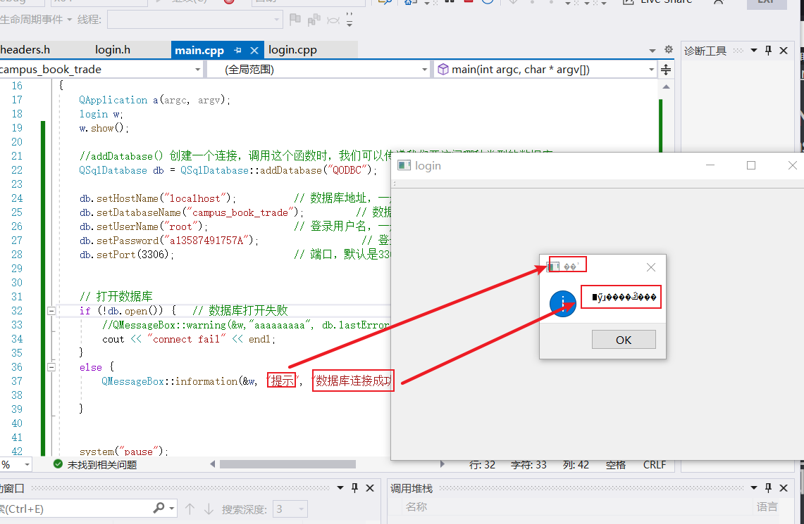
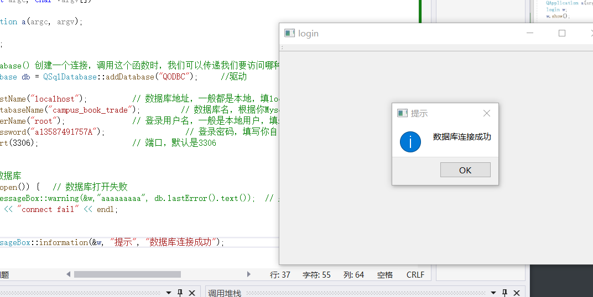

# 个人的命名规范

名称力求看就懂

方法名使用下划线，如: void show_Register_Form();

长变量名采用驼峰原则，如：bookTableView，allBookButton


C++调用MYSQL例1

```cpp
#include <stdio.h>
#include <stdlib.h>
#include<Windows.h>
#include<mysql.h>
#include<iostream>
#pragma comment(lib, "libmysql.lib")
using namespace std;

//string q 在使用mysql相关函数时记得用q.c_str()获得const char* q。（原本的q没有改变）


int main(void)
{
    MYSQL  mysql, * sock; //声明MySQL的句柄

    //这些参数要设计成文件读写方式
    const char* host = "127.0.0.1"; //因为是作为本机测试，所以填写的是本地IP
    const char* user = "root"; //这里改为你的用户名，即连接MySQL的用户名
    const char* passwd = "a13587491757A"; //这里改为你的用户密码
    const char* db = "选课系统"; //这里改为你要连接的数据库的名字,一个数据可能有几张表
    unsigned int port = 3306; //这是MySQL的服务器的端口，如果你没有修改过的话就是3306。
    const char* unix_socket = NULL; //unix_socket这是unix下的，我在Windows下，所以就把它设置为NULL
    unsigned long client_flag = 0; //这个参数一般为0

    const char* i_query = "select * from 学生信息;"; //查询语句，从那个表中查询,这里后面没有;


    MYSQL_RES* result; //保存结果集的变量
    MYSQL_ROW row; //代表的是结果集中的一行
                   //my_ulonglong row;


//=======================连接mysql测试==================================
    mysql_init(&mysql); //连接之前必须使用这个函数来初始化
    mysql_options(&mysql, MYSQL_SET_CHARSET_NAME, "gbk");
    //假如上面db声明为string，则这里的参数要写成db.c_str()
    if ((sock = mysql_real_connect(&mysql, host, user, passwd, db, port, unix_socket, client_flag)) == NULL) //连接MySQL
    {
        printf("fail to connect mysql \n");
        fprintf(stderr, " %s\n", mysql_error(&mysql));
        exit(1);
    }
    else
    {
        fprintf(stderr, "connect ok!!\n");
    }


//============================SQL语句测试==============================
    if (mysql_query(&mysql, i_query) != 0) //如果连接成功，则开始查询 .成功返回0
    {
        fprintf(stderr, "fail to query!\n");
        exit(1);
    }
    else
    {
        if ((result = mysql_store_result(&mysql)) == NULL) //保存查询的结果
        {
            fprintf(stderr, "fail to store result!\n");
            exit(1);
        }
        else
        {
            cout << result->row_count << endl;
            cout << "id\t" << "name\t" << "sex\t" << "class\t" << endl;
            while ((row = mysql_fetch_row(result)) != NULL) //读取结果集中的数据，返回的是下一行。因为保存结果集时，当前的游标在第一行【之前】
            {
                //printf("name is %s\t", row[0]); //打印当前行的第一列的数据
                //printf("id is %s\t\n", row[1]); //打印当前行的第二列的数据
                //printf("math is %s\t\n", row[2]);
                //printf("province is %s\t\n", row[3]);
                //row = mysql_num_row(result);
                //printf("%lu\n", mysql_num_row(result));
                cout << row[0] << "\t" << row[1] << "\t" << row[2] << "\t"
                    << row[3] << "\n";;
            }

        }

    }


//==============================结束操作==============================
    mysql_free_result(result); //释放结果集
    mysql_close(sock); //关闭连接
    system("pause");
    exit(EXIT_SUCCESS);

}
```

C++调用MYSQL例2

```cpp
#include <stdio.h>
#include <stdlib.h>
#include<Windows.h>
#include<mysql.h>
#include<iostream>
#pragma comment(lib, "libmysql.lib")
using namespace std;

int main() {
	//初始化mysql上下文

	MYSQL mysql, * sock;
	MYSQL_RES* result;
	MYSQL_ROW row;

	mysql_init(&mysql);
	mysql_options(&mysql, MYSQL_SET_CHARSET_NAME, "gbk");

	const char* host = "127.0.0.1";
	//const char* user = "root";
	//const char* passwd = "a13587491757A";
	//const char* db = "校园二手书交易系统";   //数据库名称
	unsigned int port = 3306;
	const char* unix_socket = NULL;
	unsigned long client_flag = 0;
	
	string user, passwd, db;
	cout << "输入用户账号:" << endl;   cin >> user;
	cout << "密码:" << endl;    cin >> passwd;

	cout << "输入要查询的数据库" << endl;
	cin >> db;


	//连接登录数据库
	if (!mysql_real_connect(&mysql, host, user.c_str(), passwd.c_str(), db.c_str(), port, unix_socket, client_flag)) {
		cout << "failed!" << endl;
	}
	else cout << "access!" << endl;

	//string q = "insert into `校园二手书交易系统`.`账号` values('4','赵六','132431254');";
	//mysql_query(&mysql, q.c_str());

	string q = "delete from 账号 as a where a.user_name='张三';";
	mysql_query(&mysql, q.c_str());

	q = "select * from  账号;";

	if (mysql_query(&mysql, q.c_str()) != 0) {
		cout << "failed 1111" << endl;
	}
	else {
		if ((result = mysql_store_result(&mysql)) == NULL) {
			cout << "search failed" << endl;
		}
		else {
			cout << result->row_count << endl;

			cout << "id\tname\tpasswd" << endl;
			while ((row = mysql_fetch_row(result)) != NULL) {
				cout << row[0] << "\t" << row[1] << "\t" << row[2] << endl;
			}
		}
	}


	return 0;
}
```

# QT快捷键

https://blog.csdn.net/weixin_39610085/article/details/111814854


# QT连接数据库

会用到ODBC数据源(64位，存在mysql安装目录下，没有就上网安装)

参考博客https://blog.csdn.net/joey_ro/article/details/105411135?spm=1001.2101.3001.6650.1&utm_medium=distribute.pc_relevant.none-task-blog-2%7Edefault%7ECTRLIST%7Edefault-1.highlightwordscore&depth_1-utm_source=distribute.pc_relevant.none-task-blog-2%7Edefault%7ECTRLIST%7Edefault-1.highlightwordscore

# VS第三方库连接相关问题

https://blog.csdn.net/rznice/article/details/51657593

##  1、报错 LINK : fatal error LNK1104: 无法打开文件“libExtensions.lib” LINK : fatal error LNK1104: 无法打开文件... 

 说明没有在   连接器-->输入-->附加依赖项没有添加所需要的xxx.lib文件


## 2、报错 VS无法解析的外部符号"__declspec(dllimport) 

说明没有配置调用到的函数的dll文件，

# QT界面中文乱码



参考博客https://blog.csdn.net/weixin_43384257/article/details/89517985

效果



# 自定义槽函数

参考博客：如何在VS2017里部署的Qt Designer上编辑槽函数https://www.freesion.com/article/35241338797/

自制加法器https://blog.csdn.net/jiangjieqazwsx/article/details/80084557

注意不同控件所包含的属性和方法。比如，Line Edit控件有text()方法获取文本，而Text Edit中用document()获取文本，且两者返回类型不同

# 实现界面跳转

参考博客https://blog.csdn.net/apple8422/article/details/72861596

若要实现从 登录界面 到 注册界面 的 的跳转(通过登录界面的"注册"按钮实现

## 方法一

### 1.在登录界面类里写一个槽函数(slot范围)

```cpp
//login.h

class login : public QMainWindow
{
    Q_OBJECT

public:
    login(QWidget *parent = Q_NULLPTR);
    ~login(){};

   
private:
    Ui::loginClass ui;
    
private slots:  //类的槽函数定义写在这里
    void AbuttomClick();
    
    void register_botton_click(); //这个槽函数实现跳转 
    
    //为了让类方法的用途一目了然，可以将方法名取为几个单词的组合，可以用下划线拼接，也可以用驼峰的方式，即还可以写成registerBottonClick。
};
```

### 2.增加一个信号

在登录界面类中再增加一个信号，用于将此信号传送给其他界面，以实现界面的跳转功能。

```cpp
//login.h

class login : public QMainWindow
{
    Q_OBJECT

public:
    login(QWidget *parent = Q_NULLPTR);
    ~login(){};

   
private:
    Ui::loginClass ui;
    
private slots:
    void AbuttomClick();
    void register_botton_click();

signals:  //信号写在这
    void showRegisterFrom(); //这个函数写个声明即可，不需要具体实现
};

```

### 3.将 "注册"按钮关联这个槽函数

### 4.实现槽函数

```cpp
void login::register_botton_click()
{
    this->hide();   //关闭当前界面，可以不写
    emit showRegisterFrom();   //激活信号，让信号传送到特定页面
}
```

### 5.在要跳转的界面(现在要跳到注册界面)类中写入接收函数

此时我要在此页面增加一个信号，用于将此信号传送给其他页面，以实现页面跳转功能。

```cpp
//Register.h
class Register : public QWidget
{
	Q_OBJECT

public:
	Register(QWidget *parent = Q_NULLPTR);
	~Register();

private:
	Ui::Register ui;

private slots:
	void receive_From_Login();  //接收在登录界面按下注册按钮的信号
};
```

```cpp
//实现接收函数
void Register::receive_From_Login()
{
	this->show();
}
```

### 6.在主函数中建立两个界面之间的联系

```cpp
int main(int argc, char *argv[])
{
    QApplication a(argc, argv);
    login login_form;
    Register register_form;

    //建立从登陆界面到注册界面的连接
    QObject::connect(&login_form, SIGNAL(showRegisterFrom()), &register_form, SLOT(receiveFromLogin()));
//connect(原界面，SIGNAL(界面跳转相关的信号函数)，目标界面，SLOT（目标界面的接收函数）)
    
    login_form.show();
    system("pause");
    return a.exec();
}

```

## 方法二

https://blog.csdn.net/weixin_45557138/article/details/106937024

直接在登录类中定义注册类的实体

```cpp
class login : public QMainWindow
{
    Q_OBJECT

public:
    login(QWidget *parent = Q_NULLPTR);
    ~login(){};

   
private:
    Ui::loginClass ui;
    Register r;   //注册界面的实例

private slots:
    void AbuttomClick();
    void register_botton_click();

    void ttt() {  
        r.show();   //直接显示成员变量的界面   
    }

};

```


# 不同窗口之间的参数传递

参考博客：https://blog.csdn.net/zbw1185/article/details/48519371

主要方法同界面跳转的方法一差不多。

例：

```cpp
//dialog.h
#ifndef DIALOG_H
#define DIALOG_H
#include <QDialog>
 
namespace Ui {
class Dialog;
}
 
class Dialog : public QDialog
{
    Q_OBJECT
 
public:
    explicit Dialog(QWidget *parent = 0);
    ~Dialog();
 
private slots:
    void on_pushButton_clicked();
 
signals:
    void sendData(QString);   //用来传递数据的信号
 
private:
    Ui::Dialog *ui;
};
 
#endif // DIALOG_H
```


```cpp
//dialog.cpp
#include "dialog.h"
#include "ui_dialog.h"
 
Dialog::Dialog(QWidget *parent) :
    QDialog(parent),
    ui(new Ui::Dialog)
{
    ui->setupUi(this);
}
 
Dialog::~Dialog()
{
    delete ui;
}
 
void Dialog::on_pushButton_clicked()
{
    emit sendData(ui->lineEdit->text());  //获取lineEdit的输入并且传递出去
}
```


```cpp
//mainwindow.h
#ifndef MAINWINDOW_H
#define MAINWINDOW_H
 
#include <QMainWindow>
 
namespace Ui {
class MainWindow;
}
 
class MainWindow : public QMainWindow
{
    Q_OBJECT
 
public:
    explicit MainWindow(QWidget *parent = 0);
    ~MainWindow();
 
private slots:
    void receiveData(QString data);   //接收传递过来的数据的槽
 
private:
    Ui::MainWindow *ui;
};
 
#endif // MAINWINDOW_H
```


```cpp
//mainwindow.cpp
#include "mainwindow.h"
#include "ui_mainwindow.h"
#include "dialog.h"
 
MainWindow::MainWindow(QWidget *parent) :
    QMainWindow(parent),
    ui(new Ui::MainWindow)
{
    ui->setupUi(this);
 
    Dialog *dlg = new Dialog;
    //关联信号和槽函数
    connect(dlg, SIGNAL(sendData(QString)), this, SLOT(receiveData(QString)));
    dlg->show();
}
 
MainWindow::~MainWindow()
{
    delete ui;
}
 
void MainWindow::receiveData(QString data)
{
    ui->textEdit->setText(data);     //获取传递过来的数据
}
```

==注意：connect中的 **receiveData(QString)** 在mainwindow的定义中，这个函数是**receiveData(QString data)**。所以，在connect中，接收信号的函数的参数只用写类型，不用写实例。==


```cpp
//main.cpp
#include "mainwindow.h"
#include <QApplication>
 
int main(int argc, char *argv[])
{
    QApplication a(argc, argv);
    MainWindow w;
    w.show();
 
    return a.exec();
}
```


# 报错：The process was ended forcefully

大概率是声明了指针没有用new初始化。

# 清空tableview

```cpp
QSqlQueryModel* res=new QSqlQueryModel(this->ui->booksTableView);
    res->clear();
    this->ui->booksTableView->setModel(res);
```

设置一个空内容的QSqlQueryModel对象，通过tableview的setmodel方法覆盖到要清空的tableview上

# ==QSqlTableModel类==

这个类可以连接数据库和tableview控件，可以实现在tableview上修改数据表内容

参考博客：https://www.freesion.com/article/362266616/
